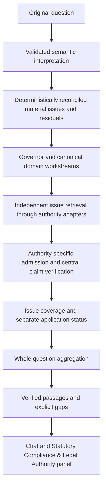

# Multi-authority workstreams implementation report

Baseline: `main` at `67511a886402c2f3746e713e2e3227d5ec406828`.
Branch: `codex/multi-authority-workstreams`.

## 1. Architecture before

The existing path interpreted and reconciled the question, selected a primary
statutory route, retrieved sources, admitted evidence, verified claims, and
projected an IRAS response. It already kept reviewed local knowledge ahead of
discovery metadata and retained the original query in evidence validation.

## 2. Architecture after

The migration is additive. The established single IRAS path and deterministic
accounting paths remain available. Multiple material issues activate the generic
path after reconciliation; incidental authority names and inferred GST on an
ordinary journal do not by themselves activate it.

## 3. Files changed

- Semantic issue contract and reconciliation (first checkpoint):
  `src/services/semanticQuestionUnderstanding.ts` and
  `tests/regression/test_material_issue_decomposition.mjs`.
- Workstream contracts and orchestration: `src/types/authorityEvidence.ts`,
  `src/services/authorityWorkstreams.ts`,
  `src/services/groundingContextBuilder.ts`, and
  `src/retrieval/evidenceQualityGate.ts`.
- Runtime and verified response: `src/services/geminiService.ts`,
  `src/services/authorityEvidenceResponse.ts`, and
  `src/utils/authorityEvidenceRouting.ts`.
- Projection and consumers: `src/utils/authorityEvidencePresentation.ts`,
  `src/types/accounting.ts`, `src/components/AuthorityCompliancePanel.tsx`,
  `src/components/ComplianceRationale.tsx`, `src/components/InputHandlerPanel.tsx`,
  `src/utils/chatPresentation.ts`, and `src/App.tsx`.
- Regressions, evaluation fixture/runner, suite registration, and the plan,
  checkpoint, and evaluation reports under `docs/`.

## 4. Generic interfaces

`SemanticQuestionIssue` and `ReconciledSemanticQuestionIssue` represent meaning
and deterministically supported mappings. `AuthorityEvidenceRequest` retains the
complete original query alongside scoped retrieval intent.

`AuthorityEvidenceProvider` supplies candidates and optional claims/traces.
Providers cannot establish coverage by declaring success: the orchestrator
admits sources and verifies claims again. `AuthorityIssueLifecycle`,
`AuthorityIssueEvidence`, `AuthorityWorkstreamResult`, and
`AuthorityWorkstreamsResult` represent the independent stages and aggregated
results. `AuthorityEvidencePresentation` is the shared render-ready projection.

## 5. IRAS adaptation and safeguards

The IRAS adapter uses the existing grounding pipeline and evidence policy with
explicit issue topic/concept scope. The raw query remains unchanged for
provenance, date, relevance, and claim checks. Its full retrieval trace reaches
the existing admission gate; the UI receives a bounded diagnostic projection.

Source-map pointers, sitemap entries, search results, semantic labels, and
provider claims do not become statutory evidence. Claims must be backed by
admitted source text. Topicless requested concepts, including relief
prioritisation, remain uncovered without directly supporting verified text.
Existing employer-benefit and multi-relief safeguards remain in use.

## 6. Workstream planning

Planning groups each governing authority with its canonical domain. Contextual
authorities do not create ownership. IRAS corporate tax, individual tax,
employment benefits, employer reporting, and GST are distinct areas.

Mapped topics determine the area before population is used as a fallback.
Subject population, source collection, governing authority, and source publisher
are separate fields. An employee's CPF Relief remains individual tax; an
employment-benefit source under employer guidance remains employment benefits.

## 7. Coverage

Each material issue tracks requested, mapped, retrieval attempted, evidence
found, admitted, verified, and covered. Coverage requires claims tied to that
issue's authority, topic, and distinctive meaning. Shared generic vocabulary
alone cannot establish coverage. Unknown issues and independently recognised
omissions remain whole-question gaps.

Initial non-IRAS adapters admit only eligible canonical reviewed local records,
with authority/domain/topic, date, provenance, and text checks. They explicitly
skip unsupported live discovery stages.

## 8. Overall status

Every material issue must have verified coverage before whole-question evidence
can be verified. Empty plans, residuals, unsupported topics, or uncovered issues
produce `INSUFFICIENT`. Verified evidence with unresolved case application is
`CONDITIONAL`; verified evidence with no unresolved application is `VERIFIED`.
Evidence status and application status are independent.

## 9. Whole-question presentation

Chat, input preview, and the compliance panel consume the same fresh projection.
It shows overall status, authority/domain sections, issue populations, verified
passages or clearly labelled reviewed summaries, official links, evidence dates,
and explicit gaps. Source/quote duplicates are combined within each workstream.
The projection must match the current raw query; stale workstreams are hidden.

Responses combine verified workstream passages and gaps deterministically.
Generated relationship explanations are not yet enabled. Existing balanced
journals and clarification prompts remain available for accounting requests.
Statutory-only issue plans do not invent a journal from a legacy payroll hint.

## 10. Validation

Final validation used Node 22.23.1:

| Check | Result |
| --- | --- |
| Preflight | Passed |
| Lint | Passed; existing warnings remain, no warnings in the new modules |
| TypeScript (`tsc -b`, included in build) | Passed |
| Production build | Passed; existing config, chunk-size and bundler warnings remain |
| Focused workstream regression | Passed |
| Focused presentation/runtime regression | Passed |
| Smoke regression | 45/45 suites passed |
| Full regression | 65/65 suites passed |
| Diff whitespace check | Passed |

The smoke/full runs include the existing semantic, IRAS retrieval/admission,
claim verification, GST, journal, FX, and conversation suites. An imported fetch
guard disabled outbound requests; suites installed their own mocks where
needed. The official-source probe was run separately with network access.

Positive tests use existing canonical reviewed CPF wage-ceiling and Section 14
records. They also verify CPF coverage surviving an independent IRAS failure,
source isolation, source-map rejection, malformed provider handling, residual
coverage, application/evidence separation, and source-backed presentation.

The independent reviewer found no remaining material production findings after
the discovery and routing fixes. Initial test failures were corrected before
the final passing run; existing fixtures were retained.

## 11. Evaluations

- Existing 36-case oracle: 36/36 authority, domain, retrieval scope, and
  missing-fact policy checks passed.
- Existing eight-case adversarial oracle: 8/8 routing checks passed, including
  presentation consistency and stale-query rejection.
- Four-case architecture oracle: all four expected workstream sets passed.
  All four whole-question results are incomplete, reflecting actual limited
  mapping/source coverage rather than promoting partial evidence.
- One public official-source probe for case A admitted verified live IRAS CPF
  Relief evidence. CPF contribution evidence remained incomplete, so the
  whole-question result remained incomplete.
- No live Gemini evaluation: `GEMINI_API_KEY` was unavailable. Oracle
  interpretations are not reported as live-model understanding.

Detailed reports are under `docs/evaluation/multi-authority-workstreams/`.

## 12. Known limitations

CPF, MOM, ACRA, MAS, and accounting adapters have limited reviewed-local
coverage; generic non-IRAS live discovery is not implemented. Existing CPF rate
material marked `NEEDS_REVIEW` is not promoted to verified evidence. Exact
held-out housing and unspecified-expense questions C/D remain unmapped by the
independent taxonomy. No statutory records or rates were changed in this work.

Case specificity remains partly question-level and conservative for mixed
general/application questions. Fully mapped single-area IRAS queries continue
using the legacy projection during migration. Images remain on their established
path. These limits prevent a production-readiness claim for uncovered areas.

Without a model, exact case B's taxonomy recognises only CPF. Its explicit tax
request now receives the known workstream plus a whole-question unresolved gap;
the runtime does not invent the unrecognised MOM/IRAS issues. Oracle decomposition
for B and deterministic no-provider decomposition are different measurements.

An explicit injected reference date affects admission/discovery, while claim
verification retains its current source-audit date. Simulation-date parity is
not implemented; production defaults use the current date throughout.
